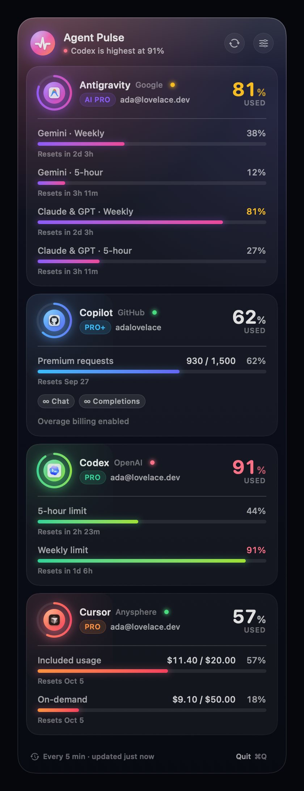
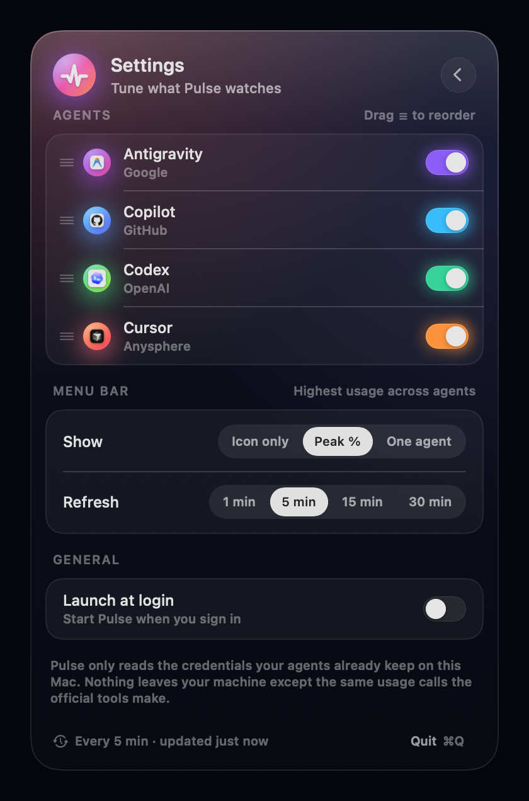

# Agent Pulse

A native macOS menu bar app that shows how much of your AI coding agents you've burned through —
**Antigravity, GitHub Copilot, Codex and Cursor** — in one glassy panel. No API keys to paste: it reuses
the sessions the official tools already keep on your Mac.

<p align="center">
  
  &nbsp;&nbsp;
  
</p>

## Install

**Homebrew** (recommended):

```sh
brew install --cask kwn00/tap/agent-pulse
```

Then launch **Agent Pulse** from `/Applications` (or Spotlight). It lives in the menu bar — there is no
Dock icon or window. Turn on *Launch at login* in its settings (⌘,) if you want it around permanently.

**Manual:** download `AgentPulse-<version>.zip` from the
[latest release](https://github.com/kwn00/agent-pulse/releases/latest), unzip, and drag
`Agent Pulse.app` into `/Applications`.

> **Gatekeeper note.** Agent Pulse is ad-hoc signed, not notarized (no Apple Developer ID). The Homebrew
> cask clears the quarantine flag for you. For the manual download macOS will say the developer can't be
> verified — right-click the app → **Open** once, or run
> `xattr -dr com.apple.quarantine "/Applications/Agent Pulse.app"`.

Requires macOS 14 Sonoma or newer (Apple silicon and Intel).

**Upgrade / remove:**

```sh
brew upgrade --cask agent-pulse
brew uninstall --cask agent-pulse          # add --zap to also delete cached snapshots and preferences
```

## What you get

- **One glance:** menu bar icon plus a percentage — the peak across all agents, or one agent you pin
  in Settings. The panel headline follows the same choice, so both numbers always agree.
- **Per-agent cards:** plan, account, a progress ring, every rate-limit window with a reset countdown,
  unlimited quotas as pills, and overage/credit notes.
- **Live headline:** "Codex is highest at 91%" or "Antigravity needs attention" — errors surface with a
  fix hint (e.g. *Open Antigravity to read model quotas*) instead of a blank card.
- **Quiet by default:** auto-refresh every 1/5/15/30 min, ⌘R to refresh, ⌘, for settings, ⌘Q to quit.
  Right-click the icon for a compact context menu. Launch-at-login toggle.
- **Remembers the last reading:** when an agent can't be reached (Antigravity closed, network down) its
  card keeps the last known numbers, dimmed, with "Not running · last read 12m ago" and a Retry.
- **Your order:** drag the ☰ grip in Settings → Agents to arrange the cards; toggles hide agents you don't use.
- **Single instance:** launching it twice just opens the running copy's panel.
- **Private:** credentials are read locally and sent only to the vendor's own usage endpoint —
  the exact same calls the official CLI/IDE makes.

### Brand tiles

Each card's tile shows the vendor's **real app icon** when the app is installed (Antigravity, Cursor,
ChatGPT/Codex, GitHub Copilot), pulled at runtime through `NSWorkspace` — the same way the Dock draws
them — so no vendor artwork ships with Agent Pulse. Missing apps fall back to an SF Symbol. To use your
own image, drop `antigravity.png` / `copilot.png` / `codex.png` / `cursor.png` into
`~/Library/Application Support/Agent Pulse/Icons/`.

## How each agent is read

| Agent | Where the session comes from | Usage source |
|---|---|---|
| **Antigravity** (Google) | The running IDE's local `language_server` process — its `--csrf_token` and listening port are discovered in-process via `libproc`/`sysctl` (no shelling out) | `POST https://127.0.0.1:<port>/exa.language_server_pb.LanguageServerService/RetrieveUserQuotaSummary` (+ `GetUserStatus` for plan/email) |
| **Copilot** (GitHub) | `~/.config/github-copilot/apps.json` / `hosts.json` written by the Copilot CLI and IDE plugins; falls back to `gh auth token` | `GET https://api.github.com/copilot_internal/user` → `quota_snapshots` |
| **Codex** (OpenAI) | `~/.codex/auth.json` (`$CODEX_HOME` honoured). Read-only: Codex owns token refresh, so an expired session shows *run `codex` once* | `GET https://chatgpt.com/backend-api/wham/usage` → 5-hour / weekly windows, extra model pools, credits |
| **Cursor** (Anysphere) | `cursorAuth/accessToken` in `~/Library/Application Support/Cursor/User/globalStorage/state.vscdb`, turned into the dashboard's `WorkosCursorSessionToken` cookie | `GET https://cursor.com/api/usage-summary` → included / on-demand / team pools in cents |

Antigravity only exposes quotas while the IDE is running (the `agy` CLI's embedded server requires a
CSRF token it never exposes, so CLI sessions can't be read). While it is closed the card shows the last
cached reading; snapshots live in `~/Library/Application Support/Agent Pulse/snapshots.json`.

## Build from source

Requirements: macOS 14 Sonoma or newer, Xcode 16+ (Swift 6 toolchain).

```sh
make app          # SwiftPM release build → build/Agent Pulse.app (ad-hoc signed)
make run          # build + open it
make test         # unit tests for every parser
make package      # universal (arm64 + x86_64) zip + sha256 in build/, as shipped in releases
```

Prefer Xcode? `brew install xcodegen && make xcodeproj` generates `AgentPulse.xcodeproj` from `project.yml`.

Copy `build/Agent Pulse.app` to `/Applications` to keep it; the *Launch at login* toggle uses
`SMAppService` and therefore needs the app to run from a real bundle.

## Debug helpers

```sh
.build/debug/AgentPulse --probe                     # fetch every provider once, print the result, exit
.build/debug/AgentPulse --snapshot out.png          # render the panel offscreen at 2×
.build/debug/AgentPulse --snapshot out.png --settings
.build/debug/AgentPulse --snapshot out.png --scrolled 140   # fake a scrolled list to inspect the edge fog
.build/debug/AgentPulse --snapshot out.png --tiles          # brand tiles: badge / bare / symbol variants
.build/debug/AgentPulse --demo                      # fictional data (also works with --probe/--snapshot)
.build/debug/AgentPulse --open                      # launch with the panel already showing
.build/debug/AgentPulse --open --settings --debug-toggle-pin   # open on Settings and flip the pin mode every 1.6s (animation QA)
AGENTPULSE_ALLOW_MULTIPLE=1 .build/debug/AgentPulse # run beside an installed copy (skips the single-instance lock)
```

`make probe` and `make snapshot` wrap the first two.

## Project layout

```
Sources/AgentPulse
├── App/          @main, AppDelegate, StatusBarController (NSStatusItem + floating NSPanel), debug commands
├── Models/       ProviderID, UsageSnapshot, UsageMetric, ProviderState/Failure
├── Providers/    One UsageProvider per agent + DemoProvider
├── Services/     UsageStore (refresh loop), AppSettings, HTTPClient (loopback-only TLS trust),
│                 ProcessScanner (libproc), SQLiteReader, JWT helpers
└── UI/           Theme tokens, PulsePanelView, ProviderCard, SettingsPane, reusable components
Tests/AgentPulseTests   Fixture-driven parser tests
scripts/                build-app.sh (SPM → .app), make-icon.swift (renders AppIcon.icns)
```

The panel is a borderless, non-activating `NSPanel` hosting SwiftUI, anchored under the status item,
sized from its content, dismissed on outside click / Escape / focus loss.

## Releasing

Push a tag and CI does the rest: `git tag v1.2.3 && git push origin v1.2.3` builds a universal
`Agent Pulse.app` on a macOS runner, zips it, and publishes a GitHub Release with the checksum. The
Homebrew tap ([kwn00/homebrew-tap](https://github.com/kwn00/homebrew-tap)) picks the new version up
automatically (its bump workflow runs every 6 hours; trigger it manually from the Actions tab to publish
immediately).

## Troubleshooting

| Card says | Meaning / fix |
|---|---|
| *Antigravity isn't running* | Open Antigravity; quotas come from its local language server. |
| *Codex session expired* | Run `codex` once — the CLI refreshes and rewrites `auth.json` itself. |
| *Copilot isn't signed in* | Run `copilot` (CLI) or sign in from your editor's Copilot plugin. |
| *Cursor session expired* | Open Cursor so it renews its token. |
| *Launch at login* flips back off | Only works when running from `Agent Pulse.app` (not `swift run`). |

## Acknowledgements

Endpoint and credential details were cross-checked against the MIT-licensed
[CodexBar](https://github.com/steipete/CodexBar) by Peter Steinberger. Agent Pulse shares no code with it.
Antigravity, Copilot, Codex and Cursor are trademarks of their respective owners; this is an unofficial tool.
